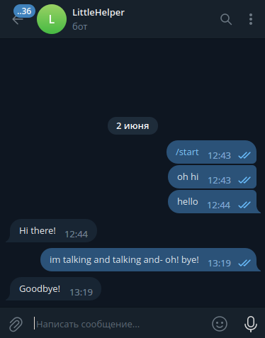
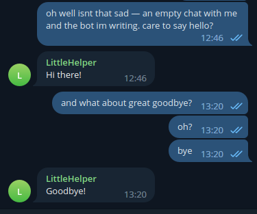

# Простой телеграм бот
Что он делает? Очень просто -- отвечает на определенные слова в сообщениях определенными сообщениями.

## Запуск:
```
python3 main.py
```
...то есть просто запуск файла `main.py`

## Результат:
наедине с ботом:



в группе с ботом:



ссылка на бота: [t.me/messageHelp_bot](https://t.me/messageHelp_bot)
